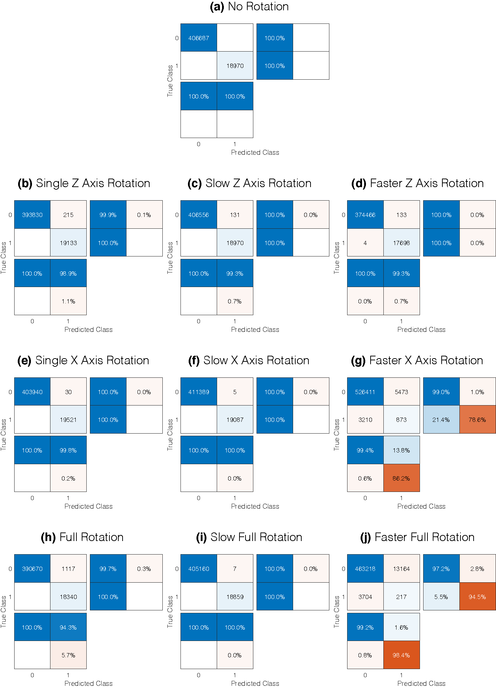

# A Robust Vision-based Algorithm for Classifying and Tracking Small Orbital Debris Using On-board Optical Cameras
This study develops a vision-based classification and tracking algorithm to address the challenges of in-situ small orbital debris environment tracking, including debris observability and instrument requirements for small debris observation. The algorithm operates in near real-time and is robust under challenging tasks in moving objects tracking such as multiple moving objects, objects with various movement trajectories and speeds, very small or faint objects, and substantial background motion. The performance of the algorithm is optimized and validated using space image data available through simulated environments generated using NASA Marshall Space Flight Center’s Dynamic Star Field Simulator of on-board optical sensors and cameras.

## Algorithms
> To view the PDF version of each image, please click on it.
### Classification
The classification algorithm identifies the bright spots in captured video sequences and classifies them as `objects` (representing orbital debris objects) or `stars`. In cases the algorithm is not able to classify any of the detected spots into one of the object or star classes, that spot will be classified as `unknowns`. The following block-diagram describes the classification algorithm's outline.

### Tracking
The tracking algorithm tracks the spots which are classified as objects in the previous step. The following block-diagram describes the tracking algorithm's outline.

## Resutls
Ten different datasets were used to evaluate the performance of the algorithms are described in the following table. For all the sample videos *Frame size* is 1080 (pixel) Height × 1920 (pixel) Width, *Frame rate* 60 frames per second (fps), *Duration* 60 seconds, *Color format* is Grayscale, and the *Source data type* is Floating-point number between 0 and 1. The title of each sample data (*to see each sample video data click on its title and to see all of them click [here](https://www.youtube.com/watch?v=5a3guBK2rlw&list=PLR0Ezs-OTZC6UFqrmYYmIAwX0QrCTFbHu)*) shows the status of the spacecraft when capturing video frames.

| Sample data            | Spots (mean ± std) | Objects (mean ± std) |
|------------------------|--------------------------:|----------------------------:|
| [No Rotation](https://youtu.be/5a3guBK2rlw)            |        118.3 ± 2.1 |            5.3 ± 2.1 |
| [Single Z Axis Rotation](https://youtu.be/Br7Luv5DpIg) |        114.8 ± 5.4 |            5.3 ± 2.0 |
| [Slow Z Axis Rotation](https://youtu.be/4tldmg_TYbw)   |        118.3 ± 2.1 |            5.3 ± 2.1 |
| [Faster Z Axis Rotation](https://youtu.be/Hb898-EUsPI) |        109.0 ± 5.4 |            4.9 ± 1.7 |
| [Single X Axis Rotation](https://youtu.be/HXZj_C4HD6I) |        117.7 ± 3.5 |            5.4 ± 1.9 |
| [Slow X Axis Rotation](https://youtu.be/tvcyuZRFVkU)   |        119.6 ± 1.5 |            5.3 ± 2.0 |
| [Faster X Axis Rotation](https://youtu.be/JYLoRxLjutw) |       148.9 ± 39.5 |            1.1 ± 1.0 |
| [Full Rotation](https://youtu.be/JvVqdXHNe18)          |        114.0 ± 4.8 |            5.1 ± 2.3 |
| [Slow Full Rotation](https://youtu.be/lXmpF35gYMU)     |        117.8 ± 3.3 |            5.2 ± 2.1 |
| [Faster Full Rotation](https://youtu.be/GQJfcZ4J-3Q)   |       133.5 ± 32.6 |            1.1 ± 0.6 |

### Classification
The used statistical measures of the performance of the classification algorithm are described in the following figure.

The following figure show the performance of the classification algorithm for the sample input videos. In addition, the output results of the tracking algorithm is available at [here](https://www.youtube.com/playlist?list=PLR0Ezs-OTZC6FXPM-u1bl0TuAcPwsHaSU).
#### No Rotation (SampleDataRun2)

### Tracking
The *accuracy* (the number of correctly tracked objects with respect to the total number of correctly tidentified objects per frame) of the tracking algorithm is shown in the following table. In addition, the output results of the classification algorithm is available at [here](https://www.youtube.com/watch?v=fYTiekzCdBI&list=PLR0Ezs-OTZC6FXPM-u1bl0TuAcPwsHaSU) (to see the output of the tracking algorithm for each sample data click on its title). Except for the *Faster Z Axis Rotation* and *Faster X Axis Rotation* samples (these are not realistic situations due to the very high speed of spacecraft), in other cases, the classification and tracking algorithms work well.

| Sample data            | Accuracy%  (mean ± std) |
|------------------------|:---------------------------:|
| [No Rotation](https://youtu.be/Dc5PuvFrSg0)            |                 100 ± 0 |
| [Single Z Axis Rotation](https://youtu.be/MINUTONbF7E) |                 100 ± 0 |
| [Slow Z Axis Rotation](https://youtu.be/fxTmYhwb43Y)   |                 100 ± 0 |
| [Faster Z Axis Rotation](https://youtu.be/aKHtzXaMWAY) |                 100 ± 0 |
| [Single X Axis Rotation](https://youtu.be/v9ue5KQiNmA) |                 100 ± 0 |
| [Slow X Axis Rotation](https://youtu.be/tgQajvqF-38)   |                 100 ± 0 |
| [Faster X Axis Rotation](https://youtu.be/THvWsD3J4SI) |                 93 ± 24 |
| [Full Rotation](https://youtu.be/VFNVB4zX9Qk)          |                 100 ± 0 |
| [Slow Full Rotation](https://youtu.be/Pe9l5cb6sLg)     |                 100 ± 0 |
| [Faster Full Rotation](https://youtu.be/sP8S-DTxj2E)   |                 68 ± 46 |

## References
Zamani, Yasin, et al. "A Robust Vision-based Algorithm for Detecting and Classifying Small Orbital Debris Using On-board Optical Cameras." (2019). [View Article](https://ntrs.nasa.gov/search.jsp?R=20190032383)
